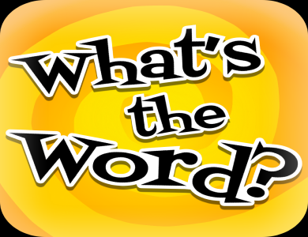

# Portfolio3.0
Portfolio 3.0 assignment to build a website with links to AboutMe, Portfolio, & Contact uisng bootstrap elements, MVC and HTML API Routes

## Table of contents
Technologies Used
Applications Used
Screenshot WIP Images
Gif Walkthrough
References
Code Snippets

## Technologies Used
HTML
CSS
Markdown
APIs
JS


## Applications Used
GitHub
ChromeDev tools
Visual Studio Code
Chrome browser

## Screenshots WIP Images


## Gif walkthrough


## References
https://codepen.io/
https://dribbble.com/shots/5432021-Instance-Bootstrap-4-Personal-Portfolio-Theme-for-Developers/attachments
http://findmatthew.com/

## Code Snippets

```<div class="container-fluid demo">
        <div class="content">
            <div id="large-header" class="large-header">
                <canvas id="demo-canvas"></canvas>
                <h1 class="main-title"><span class="thin">Krishna Addala - </span> Full Stack Developer <a class="portfolio-link"
                    href="portfolio.html">Portfolio</a></h1>
            </div>
        </div>
    </div>
  ```

  ```<div class="container">
        <div class="row">
            <div class="col-md-4 col-center work-image">
                
                <a href="https://krishnaaddala.github.io/Word-Guess-Game/" class="btn btn-primary btn-info btn-mrg">Word
                    Game Guess</a>
            </div>
  ```

  ```<div id="container">
            <div class="row">
                <a href="#" class="mx-auto"></a>
            </div>
            <div class="row">
                <div class="col-12 text-center">
                    <a href="https://www.linkedin.com/in/krishna-addala-468139b1/" target="_blank">
                        
                    </a>
                    <a href="https://github.com/krishnaaddala" target="_blank">
                        
                    </a>
                </div>
            </div>
        </div>

  ```
Git commands:

```git status
    git add .
    git commit -m "message"
    git push origin master
    ```